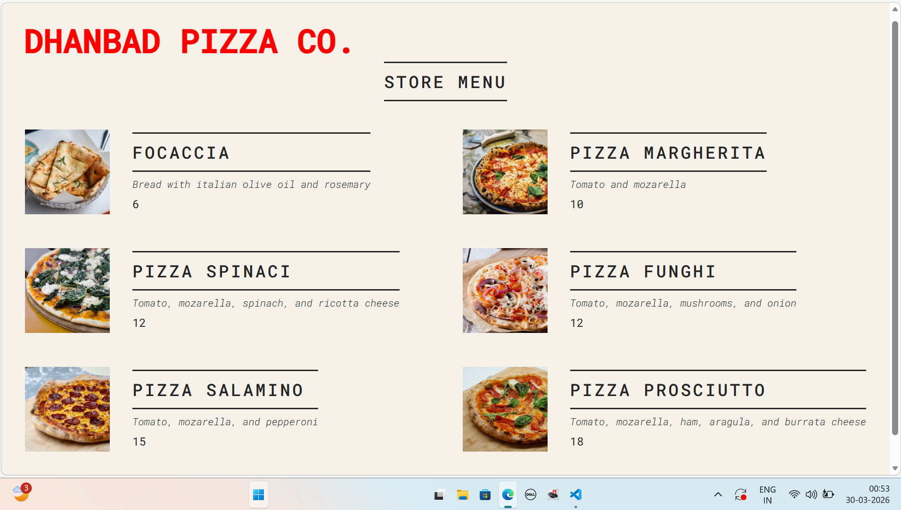

<div align="center">
  

  # 🍕 Dhanbad Pizza Co.

  **A fast, modern, and reactive pizza menu built with React v19.**

  <p>
    
    
    
  </p>
</div>

---

## 📸 Preview
Below is a visual representation of the current application state. It features a responsive grid, conditional rendering for "Sold Out" items, and real-time shop status.

<div align="center">
  
</div>

---

## ✨ Features

* **Dynamic Menu:** Automatically renders pizza cards from a data array using `.map()`.
* **Live Status:** Calculates shop opening hours ($10:00$ to $22:00$) in real-time.
* **Conditional Rendering:** * Shows an "Order" button only when the shop is open.
    * (Future) Grayscale styling for sold-out items.
* **Modern CSS:** Utilizes CSS Grid and Flexbox for a clean, professional layout.

---

## 🛠️ Built With

| Tech | Purpose |
| :--- | :--- |
| **React 19** | UI Library |
| **JavaScript (ES6+)** | Logic & Data Mapping |
| **CSS3** | Custom styling & Google Fonts |
| **HTML5** | Semantic structure |

---

## 🚀 Getting Started

1.  **Clone the repository**
    ```bash
    git clone [https://github.com/your-username/dhanbad-pizza-co.git](https://github.com/your-username/dhanbad-pizza-co.git)
    ```
2.  **Install dependencies**
    ```bash
    npm install
    ```
3.  **Run the app**
    ```bash
    npm start
    ```

---

## 📁 Project Structure

* `Header.js`: Contains the brand identity and styling.
* `Menu.js`: The core logic for rendering the list of pizzas.
* `Pizza.js`: A reusable functional component for individual menu items.
* `Footer.js`: Handles the logic for business hours and the call-to-action button.

---

<div align="center">
  <p>Created with ❤️ by your-name</p>
</div>
